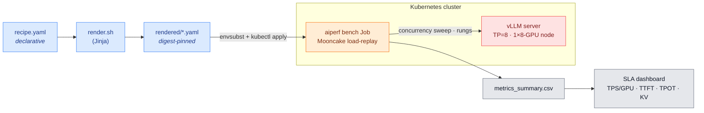

# k8s LLM Benchmark Recipes

A collection of **Kubernetes benchmark recipes** for LLM inference, organized by **scenario**
(benchmark class). Each recipe is a self-contained, schema-validated, digest-pinned *cell* whose
declarative `recipe.yaml` renders to flat, committed manifests.

```
┌─ recipe.yaml  ─  all envelope fields → recipe_hash ────────────────────────┐
│                                                                            │
│  serving stack · workload · goal                                           │
│  every field is fingerprinted into recipe_hash.                            │
│  command reference → docs/CLI.md                                      │
│                                                                            │
└────────────────────────────────────────────┬───────────────────────────────┘
                                             │  scripts/run.sh
                                             │  sweep → analysis/<scenario>/aggregate
                                             ▼
┌─ EXEMPLAR CHECK  ─  analysis/<scenario>/exemplar_check ────────────────────┐
│                                                                            │
│  max-conc-sla  →  max_concurrency_at_sla    interpolated SLA crossing      │
│  pareto        →  pareto_geomean            √(TPS/GPU · TPS/user) per rung │
│                                                                            │
│  exemplar:  run_metric ≥ reference × (1 − tolerance_pct / 100)             │
└────────────────────────────────────────────────────────────────────────────┘
```

> **Editing or adding recipes?** Start with the schema files and an existing recipe. This repository can be extended by adding structured recipes: edit the structured `recipe.yaml`, install the validation dependencies with
> `python3 -m pip install -r requirements-validation.txt`, then run `make validate render-check matrix`.
> The schema/CI tell you exactly what's missing.

## Getting Started

### Step 0 — Before you begin (prerequisites)

You need three things before you run `llmb-k8s init`:

1. **HuggingFace token** — recipes pull model weights from HuggingFace. Create a READ token at
   [huggingface.co](https://huggingface.co) under Settings → Access Tokens.
2. **NVCR / NGC credentials** — the serving images live on `nvcr.io`. Generate an API key at
   [ngc.nvidia.com](https://ngc.nvidia.com) under Setup → Generate API Key.
3. **Cluster access** — a working `kubectl` context that can reach your cluster and do the basics we need:
   schedule on GPU nodes, provision PVCs (a StorageClass for the model cache and artifacts), and create
   secrets. `init` can create a namespace for you, or you can point it at an existing one you already have
   access to. Any auth path works — kubeconfig, `aws eks`, `gcloud`, `az`, or `tsh`.

### The flow — three commands

```bash
# 1 - pick a cluster, write cluster-profiles/<profile>.env
scripts/llmb-k8s init

# 2 - namespace + secrets + per-recipe cache, download weights
scripts/llmb-k8s install <profile> --recipes <recipe-path>

# 3 - preflight, serve, sweep, results; GPUs freed on the way out
scripts/llmb-k8s run <recipe-path> <profile> --teardown --fetch
```

For interactive troubleshooting, avoid `set -e`: an expected nonzero validation exit closes the shell and can
look like a terminal crash. Check `$?` explicitly, or use `set +e` while investigating.

- **`init`** is discovery-driven — **run it with no flags**. It lists the clusters `kubectl` is connected to, you
  **pick one**, and it auto-derives the rest — a short profile label (provider-specific prefixes stripped), the
  namespace-scoped secret names `nvcr-cred` / `hf-token`, the `model-cache` PVC, and your storage classes
  (`ebs` RWO for artifacts, `fsx-lustre` RWX for shared caches). No GPU is ever held; you mostly press Enter.
  <br>_(There is one optional flag: `--cluster <label>` names the PROFILE FILE to write — it is **not** a cluster
  you have to know, and you never need it on the first run. Examples further down use it only to keep their
  output deterministic. See `llmb-k8s init --help` for the full list, incl. `--reset`.)_
- **`install`** ensures the namespace, creates the pull/HF secrets from your local creds, provisions the
  **per-recipe** cache, and downloads the weights — narrated with ETAs (image pull `~3-8 min`, a
  multi-hundred-GiB model `~45+ min`). Like `init`, it also **runs with no arguments**: `scripts/llmb-k8s install` asks which cluster profile (skipping the question when there is only one), shows what is
  **already installed** there, then lets you multi-select recipes. It is safe to re-run — an
  already-installed recipe is a no-op, not a re-download. `--recipes` accepts the same full recipe path
  used by `run`, `preflight`, and `submit` (catalog names and unambiguous directory basenames also work).
- **`run`** stages the dataset, deploys the server, drives the adaptive concurrency sweep, fetches results
  locally (`--fetch`), and with `--teardown` scales the server to 0 the instant the sweep ends — **GPUs auto-freed**.

`init` hands off directly to `install` when you let it. After installation succeeds, launching `run` or
`submit` is an explicit action, so onboarding never consumes GPUs merely because you accepted profile defaults.

#### What happens if I disconnect?

Use a **detached** launch whenever the terminal, laptop, VPN, SSH, or Teleport session might disappear.
`submit <cell> <profile>` (or `run <cell> <profile> --detach`) applies the in-cluster Job, prints a durable
run-id, and exits. The Job continues server-side; reconnect with `status`, `logs`, `watch`, or `collect`.

|                        |                                                                                                                                                                                                                                                                                                                          |
| ---------------------- | ------------------------------------------------------------------------------------------------------------------------------------------------------------------------------------------------------------------------------------------------------------------------------------------------------------------------ |
| **Safe to disconnect** | After `submit` or `run --detach` prints its success banner and run-id.                                                                                                                                                                                                                                                   |
| **Stay connected for** | Interactive `init`; `install` while it waits/stamps setup; the default attached `run`; and local `--fetch`. If `install` disconnects, re-run it safely. If an attached `run` disconnects, the cluster Job may continue but the local wait/fetch/cleanup path is interrupted—do not rely on that as the durable workflow. |

Detached handoff commands are printed after submission, including `cancel <run-id>` for an exact-run stop and
`collect <run-id>` after completion.

> **Interactive shell note:** do not enable `set -e` while manually exploring the CLI. Any expected nonzero
> validation result will exit that shell and can look like the terminal was killed. For QA, run one command at
> a time and inspect `echo $?`; CI scripts should continue to use fail-fast behavior.

<details>
<summary><b>Example — what <code>init</code> walks you through</b></summary>

`init` discovers your clusters, lets you pick one, and auto-derives everything else — you press Enter (`⏎`) past
each confirmed default:

```console
$ scripts/llmb-k8s init

── Connect ────────────────────────────────────────────────────────
  Connected clusters (kubectl contexts):
    1  example.k8s.company.net-gb300  (current)
    2  arn:aws:eks:us-west-2:…:cluster/b200-cluster

  Don't see the cluster you expect?  It isn't connected yet — reconnect and re-run init:
     tsh kube login <ctx>

? Pick a cluster [1-2]  (r = reconnect help, q = quit) [1]: ⏎

  Selected cluster (context): example.k8s.company.net-gb300
? Profile name (a label for THIS cluster profile — you choose it) [gb300-cluster]: ⏎

── Collect ────────────────────────────────────────────────────────
Context
  ✓ example.k8s.company.net-gb300  (from your cluster pick)
  ✓ example.k8s.company.net-gb300  → reachable
GPU nodes
  ✓ 4 node(s)  NVIDIA-GB300  arch=arm64
Secrets  (Secret names auto-assigned; `install` creates them from your local creds)
  ✓ NGC creds found (~/.ngc/config) — nvcr.io image pulls are covered
  ✓ HuggingFace token found ($HF_TOKEN)
Storage
  Artifacts SC — where run artifacts + logs go (RWO / ReadWriteOnce, per-run single-writer).
    A general block class (ebs / gp* / standard) is a safe default.
? Artifacts SC (RWO) [ebs]: ⏎
  Control SC — shared across pods (RWX / ReadWriteMany); needed for MULTI-NODE model caches.
    ⚠ ranked hint: fsx-lustre  (RWX not yet proven on this cluster — confirm)
? Control SC (RWX) [fsx-lustre]: ⏎
Model cache
  init runs before recipe selection, so `install` creates the cache PVC at stage time —
  sized + storage-classed for the recipe you pick. Default: create 'model-cache' then.
     Selection [Enter = defer to install]: ⏎
  · deferred — `install` will create 'model-cache' at stage time.

── Confirm ────────────────────────────────────────────────────────
Installation Summary
==================================================
🔒 Cluster (profile name): gb300-cluster
🔒 Kube context:           example.k8s.company.net-gb300
🔒 GPU product / arch:     NVIDIA-GB300 / arm64
   Namespace:              example-benchmark
   Owner:                  <your-name>
   Image-pull secret:      nvcr-cred
   HF secret:              hf-token
   Model-cache PVC:        model-cache
   Artifacts SC (RWO):     ebs
   Control SC (RWX):       fsx-lustre

   Fields marked 🔒 are identity — changing them means a different profile.
Continue?  [Y]es, write profile / [e]dit / [q]uit: ⏎

── Done: run-ready proof (no GPU) ─────────────────────────────────
✓ Cluster gb300-cluster is RUN-READY.
```

`install` then provisions the namespace + secrets, the per-recipe cache, and the weight download — each phase
banner-lined with an honest ETA (`▸ <stage> — <eta>`):

```console
$ scripts/llmb-k8s install gb300-cluster --recipes llm-perf/kvbm/qwen3-0-6b-gb300-vllm-agg-kvbm-pareto

── Prerequisites (namespace · secrets) ─────────────────────────────
  ✓ created namespace 'example-benchmark'
  ✓ created secret 'nvcr-cred' from ~/.ngc/config
  ✓ created secret 'hf-token' from $HF_TOKEN

── Per-recipe model caches ────────────────────────────────────────
  ▸ Provisioning model-cache PVC(s)  (a WaitForFirstConsumer block class (e.g. EBS) stays Pending
    until the first pod mounts it — a brief Pending here is NORMAL, not a hang)
  ✓ llm-perf/kvbm/qwen3-0-6b-gb300-vllm-agg-kvbm-pareto [recipe] → created PVC 'qwen3-model-cache' (20Gi, ReadWriteOnce, sc=ebs)

── Downloading ────────────────────────────────────────────────────
  ▸ Pulling the downloader image

  → Qwen/Qwen3-0.6B  → cache qwen3-model-cache
  ▸ Downloading model to cache
    Applying Job llmb-download-… ✓
    ✓ verified
```

`llmb-k8s fleet` gives the live cluster → namespace → run view (active runs first, your GPUs only):

```console
$ scripts/llmb-k8s fleet
ACTIVE  1 run · 1 GPU (ours)   |   fleet 1 up · 1/16 GPU used · 2026-07-30 12:41:03Z

━━ gb300-cluster  [NVIDIA-GB300]  ━━━━━━━━━━━━━━━━━━━━━━━━━━━━━━━━━━━━
   namespace example-benchmark · nodes 3/4 free · ours 1 node (1g)
     STATUS     RUN / SERVER                         GPU  AGE / EXPECTED  SWEEP
     ● RUNNING  qwen3-0-6b-gb300  c=64 sweep          1    12m / ~26m     ●●●○

legend  ● RUNNING · ● LOADING (server warming) · ● PENDING · ● STUCK (crash-loop) · ✓ done · ✗ FAILED · SWEEP = concurrency rungs
```

</details>

<details>
<summary><b>Individual commands / advanced</b> — the five guided verbs run one at a time, with per-step walk-throughs</summary>

You never *need* these to get a benchmark — `llmb-k8s init` chains them for you. Reach for them when you
want to drive a single stage by hand, re-run just one cell, or detach a long run. The full path is five
guided verbs; each shows its work as it happens (`✓ / ⚠ / ❌ / 🔒`), stops at the first fixable blocker,
and never renders a wall of noise.

```
tsh kube login <ctx>                       authenticate to the target cluster
  └─ llmb-k8s init                        ①  onboard  → detect → confirm → write & PROVE the profile (no GPU)
     (--cluster <label> optional: names the profile FILE; omit it and init derives one)
     └─ llmb-k8s install --cluster <name>  ②  provision → pick recipes (GPU-filtered) → stage → download weights
        └─ llmb-k8s run   <cell> <name>    ③  benchmark → stage → deploy → concurrency sweep → fetch
           └─ llmb-k8s publish <cell> …    ④  record   → metric + RESULTS.md + catalog (local result record)
              └─ llmb-k8s fleet            ⑤  observe  → live, all-clusters pane, active runs first
```

The profile supplies cluster-specific variables; the recipe encodes all benchmark truth.

### ① `init` — onboard a cluster (no GPU held, ever)

> **Prerequisites:** HF token, NGC/NVCR credentials, a reachable `kubectl` context — see [Step 0](#step-0--before-you-begin-prerequisites).

`init` auto-detects every cluster fact, has you **confirm each**, writes `cluster-profiles/<name>.env`
atomically, then **proves it run-ready** with a no-GPU readiness battery. Interactive by default;
`--play <f>` applies a saved playfile headlessly and `--dry-run/-n` detects + renders without writing.

```console
$ llmb-k8s init --cluster gb300-cluster     # --cluster is OPTIONAL: it just fixes the profile
                                           # filename so this transcript is reproducible.
                                           # Normally you run a bare `llmb-k8s init`.

llmb-k8s init — fresh cluster profile wizard
Target profile: cluster-profiles/gb300-cluster.env  (does not exist — creating)

── Collect ────────────────────────────────────────────────────────────────
Context     ✓ example.k8s.company.net-gb300  → reachable (cluster-info OK)
Namespace   ✓ example-benchmark     → RBAC: create pods/secrets/jobs, list pvc  allowed
GPU nodes   ✓ 4 nodes  nvidia.com/gpu.product=NVIDIA-GB300  arch=arm64  (16 GPU, 12 free)
Storage     ✓ Artifacts (RWO): ebs        ⚠ Control-plane (RWX): fsx-lustre  [confirm — RWX not yet proven]
Secrets     ✓ Image-pull: nvcr-cred       ✓ HF token: hf-token
Model cache ❌ PVC "shared-model-cache" does not exist in namespace example-benchmark.
               A run WILL start against a non-existent cache and fail after GPU allocation.
               Fix — choose one:  [1] existing RWX PVC  [2] provision now  [3] name I'll create at stage
               Selection: 1  →  ✓ qwen3-model-cache

── Confirm ────────────────────────────────────────────────────────────────
🔒 Cluster (profile name): gb300-cluster     🔒 Kube context: example.k8s.company.net-gb300
   Namespace: example-benchmark   GPU/arch: NVIDIA-GB300 / arm64   Model-cache PVC: qwen3-model-cache
   Fields marked 🔒 are identity — changing them means a different profile.
Continue?  [Yes, write profile]  > Yes

── Done: run-ready proof (no GPU) ─────────────────────────────────────────
✓ nodes         4× NVIDIA-GB300 arm64
✓ pull-secret   nvcr-cred → registry auth OK (nvcr.io reachable)
✓ artifacts SC  ebs → PVC bound + kubectl cp round-trip OK
✓ control RWX   fsx-lustre → ReadWriteMany bind OK
✓ var-reconcile all referenced ${VAR}s resolve (no empty required vars)

✓ Cluster gb300-cluster is RUN-READY.

── Next: set up recipes on this cluster ───────────────────────────
  Downloads model weights + prereqs onto the cluster:  llmb-k8s install --cluster gb300-cluster
  Continuing to recipe selection…

── Recipe selection ───────────────────────────────────────────────
  Cells matching this cluster's GPU  (🔒 = already installed, non-selectable)
  ...
```

Once the cluster is **RUN-READY**, `init` flows **straight into the install stage's recipe selector** —
no second "set up recipes now?" prompt, and no re-asking to confirm the profile it just proved. The
selector's *empty-to-skip* is the natural exit if you only wanted to provision the cluster. (Non-interactive
`--play` runs just print the `install` command instead of launching it.)

The ladder **stops at the first `❌` with one fix and exits 1** — a failed pull-secret prints the exact
`kubectl … | base64 -d` to confirm the credential, and nothing below it. Warnings (`⚠`) never stop the
ladder or fail the exit code.

### ② `install` — provision prereqs + stage the recipes you pick

`install` filters the catalog to the **cells that match this cluster's GPU**, shows already-installed
cells greyed-out (`🔒`, non-selectable — install is idempotent), then per selected cell runs
stage → preflight → stamps the result. It downloads the **de-duplicated union** of the models the
selected cells need. Preview the matrix offline any time with `--list-recipes`:

```console
$ llmb-k8s install b200-cluster --list-recipes

── Recipes matching NVIDIA-B200 on b200-cluster ─────────────────────
     cell                                                               install
     ────────────────────────────────────────────────────────────────  ──────────────────────
  🔒 llm-perf/kvbm/qwen3-0-6b-b200-vllm-agg-kvbm-pareto                 installed
     llm-perf/Glm5/B200_k8s/Agg/1k_1k/glm5-fp8-b200-sglang15-…-c4-1024  —

  2 matching · 1 installed · 1 available
  Install:  llmb-k8s install b200-cluster --recipes <cell>[,<cell>...]   (or --all-matching)
```

```console
$ llmb-k8s install --cluster b200-cluster

── Recipe selection ───────────────────────────────────────────────
  Cells matching this cluster's GPU  (🔒 = already installed, non-selectable)

  🔒  --  llm-perf/kvbm/qwen3-0-6b-b200-vllm-agg-kvbm-pareto              kvbm · pareto
       1  llm-perf/Glm5/B200_k8s/Agg/1k_1k/glm5-fp8-b200-…-c4-1024        1k/1k · pareto
       2  llm-perf/Glm5/B200_k8s/Disagg/sglang_dynamo/1k_1k/…-c2576-1p1d  1k/1k · pareto

Select recipes to set up (comma-separated numbers, or 'all', or empty to skip):
  ? [all]: 1

── Model cache ─────────────────────────────────────────────────────
  ✓ Qwen/Qwen3-0.6B  already on PVC (qwen3-model-cache)

── Per-cell setup ─────────────────────────────────────────────────────
  → llm-perf/kvbm/qwen3-0-6b-gb300-vllm-agg-kvbm-pareto  (kvbm · pareto)
    staging via stage-dataset.sh ... ✓
    preflight ... ✓

── Summary ────────────────────────────────────────────────────────
  ✓ ready: 1   ⚠ needs-input: 0   ❌ blocked: 0

  Next: llmb-k8s run llm-perf/kvbm/qwen3-0-6b-gb300-vllm-agg-kvbm-pareto gb300-cluster
```

A staging or preflight failure marks that cell `❌ blocked` with a concrete one-line fix and moves to the
next cell — the run stamp records every attempt (audit trail; feeds the coming `fleet --grid`), but only a
clean stage + non-failing preflight greys a cell out as installed.

### ③ `run` — the full benchmark lifecycle

`run` stages the dataset/traces, deploys the server, waits ready, then drives the **adaptive concurrency
sweep** — with per-rung `✓/✗` progress injected into the live log so you can watch it climb without
wading through aiperf output:

```console
$ llmb-k8s run llm-perf/kvbm/qwen3-0-6b-gb300-vllm-agg-kvbm-pareto gb300-cluster
  run-id: 20260729-qwen3-0-6b-gb300-vllm-agg-kvbm-pareto-a1b2   (dated, sortable, unique)
  ✓ staged  ✓ deployed  ✓ server ready (1/1 GPU)  →  sweeping

───────────────────────────────────────────────────────────────────────
  ✓   c=1     done                                [time]
  ✓   c=8     done                                [time]
  ✓   c=16    done                                [time]
  ✓   c=32    done                                [time]
  ✓   c=64    done                                [time]
───────────────────────────────────────────────────────────────────────
  sweep complete ✓  ·  5/5 rungs  ·  pareto_geomean = <value>
  ✓ fetched results → recipes/…/runs/20260729-…-a1b2/
```

Prefer to detach? `llmb-k8s submit <cell> <name>` applies the Job + server and returns a run-id
immediately. Use `llmb-k8s status <run-id>`, `logs`, or `watch` while it runs; `llmb-k8s cancel <run-id>`
stops exactly that active detached run; and `llmb-k8s collect <run-id>` fetches + publishes it after completion.
`llmb-k8s reclaim --cluster <name>` remains the stale/broken/finished-resource cleanup tool.

### ④ `publish` — record the result

```console
$ llmb-k8s publish llm-perf/kvbm/qwen3-0-6b-gb300-vllm-agg-kvbm-pareto gb300-cluster runs/20260729-…-a1b2
  ✓ metric        pareto_geomean = <value>   (exemplar ≥ ref × (1 − tol%))  PASS
  ✓ RESULTS.md    updated        ✓ catalog rebuilt        ✓ runs.jsonl appended
```

This writes the **local, committed result record**.

### ⑤ `fleet` — watch every cluster at once

`llmb-k8s fleet` is a live, **active-runs-first** multi-cluster pane: the first lines answer *what's
benchmarking · how many GPUs are mine · ETA*, with idle/infra servers collapsed into a one-line tail.

```console
$ llmb-k8s fleet
  CLUSTER            RUN (active first)                          GPU  ETA      STATE
  gb300-cluster   qwen3-0-6b-gb300  c=64 sweep                1    ~14m     ▶ benchmarking
  b200-cluster     glm5-fp8-b200-1k1k  c=2576 point           16   ~31m     ▶ benchmarking
  example-gpu-cluster        —                                          0    —        · 6 idle · 2 infra
  Legend  ▶ active · · idle/infra collapsed · GPU = ours only    (watch: llmb-k8s fleet --watch 15)
```

**Full verb table, `run` flags, and cross-cutting behaviors (profile resolution · target-compat gate ·
lane routing · failure-recovery resume): [`docs/CLI.md`](docs/CLI.md).**

</details>

## Scenarios

Each recipe belongs to a scenario (benchmark class) — a top-level `recipes/<scenario>/` fork with
its own schema + analysis. Click the scenario for its deep dive (prerequisites + links).

| Scenario                              | Measures                                                                                                               | Driver               | Modes                          |
| ------------------------------------- | ---------------------------------------------------------------------------------------------------------------------- | -------------------- | ------------------------------ |
| **[`llm-perf`](#deep-dive-llm-perf)** | **Serving performance** — TPS/GPU · TPS/User · TTFT · TPOT under a TTFT/TPOT SLA. *How well the server serves tokens.* | aiperf (load replay) | `mooncake-trace` · `synthetic` |

**Goals** — each is a sub-class of its scenario specifying *what* to optimize and *how* to measure it:

| Scenario   | Goal                  | Exemplar metric          | Answers                                               |
| ---------- | --------------------- | ------------------------ | ----------------------------------------------------- |
| `llm-perf` | `max-concurrency-sla` | `max_concurrency_at_sla` | Highest concurrency still meeting TTFT/TPOT SLA       |
| `llm-perf` | `pareto`              | `pareto_geomean`         | TPS/GPU × TPS/user Pareto frontier (efficiency curve) |

<a id="deep-dive-llm-perf"></a>

<details>
<summary><b>llm-perf</b> — serving-performance benchmarks (aiperf) · prerequisites · links</summary>



**What it does.** Deploys a served model (default: vLLM, TP=8, one 8×GPU node) and runs an aiperf full-trace Mooncake sweep over client concurrency. Per rung:

- Output-TPS/GPU vs TPS/User trade-off
- TTFT/TPOT profile and ISL/OSL distribution
- Interactive dashboard + machine-readable `metrics_summary.csv`
- SLA = fail if **either** TTFT or TPOT exceeds its limit

**Goals** — a recipe declares a **`goal`**: what to determine, as a named bundle of {workload + sweep strategy + exemplar method}. New goals plug in here — each names its own required fields and exemplar method (enforced by `check_invariants`).

| goal                                  | workload                                  | sweep                                                                                                   | exemplar                                                                                                                                             |
| ------------------------------------- | ----------------------------------------- | ------------------------------------------------------------------------------------------------------- | ---------------------------------------------------------------------------------------------------------------------------------------------------- |
| **`max-concurrency-sla`** *(default)* | a pinned trace/distribution (256k, 1M, …) | **adaptive geometric-grid** concurrency search — deterministic, ~2–4 rungs (`scripts/sweep_planner.py`) | **interpolated `max_concurrency_at_sla`** = the continuous SLA crossing, so A-vs-B compares to any precision (`analysis/llm-perf/exemplar_check.py`) |
| **`pareto`**                          | a pinned trace/distribution               | **full FIXED** concurrency sweep — trace the whole curve (same rungs across clusters)                   | **`pareto_geomean`** = geomean over rungs of √(Output-TPS/GPU · Output-TPS/user) — one scalar comparing the throughput-latency trade-off             |
| _future, e.g._ `static-isl-osl`       | synthetic fixed ISL/OSL (no trace)        | static concurrency points                                                                               | a throughput/latency-at-load metric                                                                                                                  |

**Prerequisites.**

- A k8s cluster with a schedulable **8×GPU node** (mind the DRA-vs-device-plugin gotcha — see
  `TROUBLESHOOTING.md`).
- **Model cache PVC** + **HF pull secret** (both referenced by name from your cluster-profile —
  never vendored).
- A filled **cluster-profile** (`cluster-profiles/<cluster>.env`, gitignored).
- *Optional:* a reachable **DCGM exporter** for GPU-utilization telemetry.

**Links.** Findings / RESULTS · deep-dive ANALYSIS ·
what helped / didn't (LESSONS) · troubleshooting ·
[serving stack](serving/vllm-agg/).

</details>

## Featured recipes

The recipe families on this branch and what each one measures. The complete inventory is the
auto-generated matrix below.

| Recipe family                   | What it measures                                                                | Serving                               | Cells |
| ------------------------------- | ------------------------------------------------------------------------------- | ------------------------------------- | ----- |
| **GLM-5** · B200                | llm-perf, fixed ISL/OSL token throughput at target concurrency, aiperf `pareto` | sglang aggregated                     | 3     |
| **GLM-5** · B200                | llm-perf, fixed ISL/OSL token throughput at target concurrency, aiperf `pareto` | Dynamo + sglang prefill/decode + NIXL | 24    |
| **Nemotron Ultra NVFP4** · B200 | llm-perf, fixed ISL/OSL token throughput at target concurrency, aiperf `pareto` | Dynamo + sglang prefill/decode + NIXL | 3     |
| **Qwen3 KVBM** · B200           | Dynamo KV feature testing — KVBM offload to CPU memory, aiperf `pareto`         | vllm aggregated                       | 1     |

## Matrix — supported / validated

<!-- MATRIX:START -->
_Auto-generated by `scripts/build_catalog.py` — do not hand-edit between the markers._

**31 recipes**

### Coverage

_✓ marks a covered model·GPU × engine·serving combo (`×N` = N cells there). Engine column: `engine` when no orchestration framework, `engine+framework` (e.g. `sglang+dynamo`) when one is used. Empty = not covered yet._

**llm-perf · pareto** — glm5-9600-agentic-code-500s-seed42-sessionfit9000-20260715, synthetic

| model · gpu | sglang+dynamo-disaggregated | sglang-aggregated | vllm+dynamo-aggregated |
|---|---|---|---|
| glm5-fp8 · B200 | ✓ ×24 | ✓ ×3 |  |
| nemotron-ultra-nvfp4 · B200 | ✓ ×3 |  |  |
| qwen3-0-6b · B200 |  |  | ✓ |

### Recipes

_Two identities per row. **`benchmark_id`** = the stable identity of *what is measured* (model · hardware · deployment shape · workload · SLA); it stays constant across image rolls and `extra_args` tuning, so **group by it to compare results over time**. **`recipe_hash`** (`recipe_hash.py`) = the *exact recipe* — it additionally covers the image digest, every `extra_args` flag, and the rendered manifests, so it moves on any of those; **tag a run with it to prove the byte-identical setup**. `wall h (p50)` / `GPU·h (p50)` = median over all published runs logged in `runs.jsonl` (blank = not yet run; single run = that run's value)._

| recipe | model | gpu | arch | agent | engine | serving | scenario | goal | distribution | mode | launcher | benchmark_id | recipe_hash | wall h (p50) | GPU·h (p50) | results |
|---|---|---|---|---|---|---|---|---|---|---|---|---|---|---|---|---|
| [qwen3-0-6b-b200-vllm-agg-kvbm-pareto](recipes/llm-perf/kvbm/qwen3-0-6b-b200-vllm-agg-kvbm-pareto/) | qwen3-0-6b | B200 | amd64 |  | vllm+dynamo | aggregated | llm-perf | pareto | glm5-9600-agentic-code-500s-seed42-sessionfit9000-20260715 | mooncake-trace | aiperf | `2f9d41edfe49` | `b5427e6cfa09` |  |  |  |
| [glm5-agg-16k512-sglang15-c4-256](recipes/llm-perf/Glm5/B200_k8s/Agg/16k_512/glm5-fp8-b200-sglang15-agg-c4-256/) | glm5-fp8 | B200 | amd64 |  | sglang | aggregated | llm-perf | pareto | synthetic | synthetic | aiperf | `9e5a169d1a95` | `ffd0650b40ad` |  |  |  |
| [glm5-agg-1k1k-sglang15-c4-1024](recipes/llm-perf/Glm5/B200_k8s/Agg/1k_1k/glm5-fp8-b200-sglang15-agg-c4-1024/) | glm5-fp8 | B200 | amd64 |  | sglang | aggregated | llm-perf | pareto | synthetic | synthetic | aiperf | `06399fbaa6f7` | `9780c34d907a` |  |  |  |
| [glm5-agg-8k1k-sglang15-c4-256](recipes/llm-perf/Glm5/B200_k8s/Agg/8k_1k/glm5-fp8-b200-sglang15-agg-c4-256/) | glm5-fp8 | B200 | amd64 |  | sglang | aggregated | llm-perf | pareto | synthetic | synthetic | aiperf | `4388f43080d7` | `7b78a0a2010d` |  |  |  |
| [glm5-fp8-b200-sglang-dynamo14-16k512-hightpt-c224-1p2d](recipes/llm-perf/Glm5/B200_k8s/Disagg/sglang_dynamo/16k_512/glm5-fp8-b200-sglang-dynamo14-16k512-hightpt-c224-1p2d/) | glm5-fp8 | B200 | amd64 |  | sglang+dynamo | disaggregated | llm-perf | pareto | synthetic | synthetic | aiperf | `636b4bea01d0` | `198cda36e06d` |  |  |  |
| [glm5-16k512-hightpt-dynamo14-c240-1p1d](recipes/llm-perf/Glm5/B200_k8s/Disagg/sglang_dynamo/16k_512/glm5-fp8-b200-sglang-dynamo14-16k512-hightpt-c240-1p1d/) | glm5-fp8 | B200 | amd64 |  | sglang+dynamo | disaggregated | llm-perf | pareto | synthetic | synthetic | aiperf | `ddc55b211bbe` | `a1a3465a458a` |  |  |  |
| [glm5-fp8-b200-sglang-dynamo14-16k512-hightpt-c304-2p1d](recipes/llm-perf/Glm5/B200_k8s/Disagg/sglang_dynamo/16k_512/glm5-fp8-b200-sglang-dynamo14-16k512-hightpt-c304-2p1d/) | glm5-fp8 | B200 | amd64 |  | sglang+dynamo | disaggregated | llm-perf | pareto | synthetic | synthetic | aiperf | `4939baeeec3d` | `e71482135c31` |  |  |  |
| [glm5-fp8-b200-sglang-dynamo14-16k512-lowlat-c128-1p2d](recipes/llm-perf/Glm5/B200_k8s/Disagg/sglang_dynamo/16k_512/glm5-fp8-b200-sglang-dynamo14-16k512-lowlat-c128-1p2d/) | glm5-fp8 | B200 | amd64 |  | sglang+dynamo | disaggregated | llm-perf | pareto | synthetic | synthetic | aiperf | `a43d9a5ea0fc` | `0b4f0d074647` |  |  |  |
| [glm5-fp8-b200-sglang-dynamo14-16k512-lowlat-c128-1p3d](recipes/llm-perf/Glm5/B200_k8s/Disagg/sglang_dynamo/16k_512/glm5-fp8-b200-sglang-dynamo14-16k512-lowlat-c128-1p3d/) | glm5-fp8 | B200 | amd64 |  | sglang+dynamo | disaggregated | llm-perf | pareto | synthetic | synthetic | aiperf | `034d730aa00b` | `e7adb48d8a5a` |  |  |  |
| [glm5-fp8-b200-sglang-dynamo14-16k512-lowlat-c32-1p7d](recipes/llm-perf/Glm5/B200_k8s/Disagg/sglang_dynamo/16k_512/glm5-fp8-b200-sglang-dynamo14-16k512-lowlat-c32-1p7d/) | glm5-fp8 | B200 | amd64 |  | sglang+dynamo | disaggregated | llm-perf | pareto | synthetic | synthetic | aiperf | `d7366f36ae80` | `6ccd9959fd5d` |  |  |  |
| [glm5-fp8-b200-sglang-dynamo14-16k512-lowlat-c64-1p5d](recipes/llm-perf/Glm5/B200_k8s/Disagg/sglang_dynamo/16k_512/glm5-fp8-b200-sglang-dynamo14-16k512-lowlat-c64-1p5d/) | glm5-fp8 | B200 | amd64 |  | sglang+dynamo | disaggregated | llm-perf | pareto | synthetic | synthetic | aiperf | `4e56b4f775cc` | `86e0722e12d6` |  |  |  |
| [glm5-fp8-b200-sglang-dynamo14-16k512-lowlat-c8-1p8d](recipes/llm-perf/Glm5/B200_k8s/Disagg/sglang_dynamo/16k_512/glm5-fp8-b200-sglang-dynamo14-16k512-lowlat-c8-1p8d/) | glm5-fp8 | B200 | amd64 |  | sglang+dynamo | disaggregated | llm-perf | pareto | synthetic | synthetic | aiperf | `c67c34b422d2` | `c4655d8cd469` |  |  |  |
| [glm5-fp8-b200-sglang-dynamo14-16k512-lowlat-c96-1p4d](recipes/llm-perf/Glm5/B200_k8s/Disagg/sglang_dynamo/16k_512/glm5-fp8-b200-sglang-dynamo14-16k512-lowlat-c96-1p4d/) | glm5-fp8 | B200 | amd64 |  | sglang+dynamo | disaggregated | llm-perf | pareto | synthetic | synthetic | aiperf | `ac567418ce9e` | `28df2b98d321` |  |  |  |
| [glm5-fp8-b200-sglang-dynamo14-1k1k-hightpt-c1248-1p2d](recipes/llm-perf/Glm5/B200_k8s/Disagg/sglang_dynamo/1k_1k/glm5-fp8-b200-sglang-dynamo14-1k1k-hightpt-c1248-1p2d/) | glm5-fp8 | B200 | amd64 |  | sglang+dynamo | disaggregated | llm-perf | pareto | synthetic | synthetic | aiperf | `cab044a1772a` | `5748dbc318d5` |  |  |  |
| [glm5-1k1k-hightpt-dynamo14-c2576-1p1d](recipes/llm-perf/Glm5/B200_k8s/Disagg/sglang_dynamo/1k_1k/glm5-fp8-b200-sglang-dynamo14-1k1k-hightpt-c2576-1p1d/) | glm5-fp8 | B200 | amd64 |  | sglang+dynamo | disaggregated | llm-perf | pareto | synthetic | synthetic | aiperf | `719a5a33c947` | `24212feecd36` |  |  |  |
| [glm5-fp8-b200-sglang-dynamo14-1k1k-hightpt-c576-1p4d](recipes/llm-perf/Glm5/B200_k8s/Disagg/sglang_dynamo/1k_1k/glm5-fp8-b200-sglang-dynamo14-1k1k-hightpt-c576-1p4d/) | glm5-fp8 | B200 | amd64 |  | sglang+dynamo | disaggregated | llm-perf | pareto | synthetic | synthetic | aiperf | `5c0a5734f9c0` | `d79e2c2329dd` |  |  |  |
| [glm5-fp8-b200-sglang-dynamo14-1k1k-hightpt-c800-1p3d](recipes/llm-perf/Glm5/B200_k8s/Disagg/sglang_dynamo/1k_1k/glm5-fp8-b200-sglang-dynamo14-1k1k-hightpt-c800-1p3d/) | glm5-fp8 | B200 | amd64 |  | sglang+dynamo | disaggregated | llm-perf | pareto | synthetic | synthetic | aiperf | `de276ba22abd` | `d65630005ed7` |  |  |  |
| [glm5-fp8-b200-sglang-dynamo14-1k1k-lowlat-c16-1p8d](recipes/llm-perf/Glm5/B200_k8s/Disagg/sglang_dynamo/1k_1k/glm5-fp8-b200-sglang-dynamo14-1k1k-lowlat-c16-1p8d/) | glm5-fp8 | B200 | amd64 |  | sglang+dynamo | disaggregated | llm-perf | pareto | synthetic | synthetic | aiperf | `97aa11d008e5` | `eb4b613d807d` |  |  |  |
| [glm5-fp8-b200-sglang-dynamo14-1k1k-lowlat-c512x256x128x64x32-1p8d](recipes/llm-perf/Glm5/B200_k8s/Disagg/sglang_dynamo/1k_1k/glm5-fp8-b200-sglang-dynamo14-1k1k-lowlat-c512x256x128x64x32-1p8d/) | glm5-fp8 | B200 | amd64 |  | sglang+dynamo | disaggregated | llm-perf | pareto | synthetic | synthetic | aiperf | `baa1c238bc35` | `457e23ee6224` |  |  |  |
| [glm5-fp8-b200-sglang-dynamo14-8k1k-hightpt-c224-1p2d](recipes/llm-perf/Glm5/B200_k8s/Disagg/sglang_dynamo/8k_1k/glm5-fp8-b200-sglang-dynamo14-8k1k-hightpt-c224-1p2d/) | glm5-fp8 | B200 | amd64 |  | sglang+dynamo | disaggregated | llm-perf | pareto | synthetic | synthetic | aiperf | `434af2573699` | `5744224d58cb` |  |  |  |
| [glm5-8k1k-hightpt-dynamo14-c240-1p1d](recipes/llm-perf/Glm5/B200_k8s/Disagg/sglang_dynamo/8k_1k/glm5-fp8-b200-sglang-dynamo14-8k1k-hightpt-c240-1p1d/) | glm5-fp8 | B200 | amd64 |  | sglang+dynamo | disaggregated | llm-perf | pareto | synthetic | synthetic | aiperf | `b1ac06c0546e` | `3f177e600f41` |  |  |  |
| [glm5-fp8-b200-sglang-dynamo14-8k1k-hightpt-c560-2p1d](recipes/llm-perf/Glm5/B200_k8s/Disagg/sglang_dynamo/8k_1k/glm5-fp8-b200-sglang-dynamo14-8k1k-hightpt-c560-2p1d/) | glm5-fp8 | B200 | amd64 |  | sglang+dynamo | disaggregated | llm-perf | pareto | synthetic | synthetic | aiperf | `a39a60cc2038` | `75f81c9a4f30` |  |  |  |
| [glm5-fp8-b200-sglang-dynamo14-8k1k-lowlat-c12-1p8d](recipes/llm-perf/Glm5/B200_k8s/Disagg/sglang_dynamo/8k_1k/glm5-fp8-b200-sglang-dynamo14-8k1k-lowlat-c12-1p8d/) | glm5-fp8 | B200 | amd64 |  | sglang+dynamo | disaggregated | llm-perf | pareto | synthetic | synthetic | aiperf | `baf77c9f1e9b` | `102235fe74da` |  |  |  |
| [glm5-fp8-b200-sglang-dynamo14-8k1k-lowlat-c128-1p5d](recipes/llm-perf/Glm5/B200_k8s/Disagg/sglang_dynamo/8k_1k/glm5-fp8-b200-sglang-dynamo14-8k1k-lowlat-c128-1p5d/) | glm5-fp8 | B200 | amd64 |  | sglang+dynamo | disaggregated | llm-perf | pareto | synthetic | synthetic | aiperf | `1ee2e4a85355` | `2b7e30967def` |  |  |  |
| [glm5-fp8-b200-sglang-dynamo14-8k1k-lowlat-c200-1p4d](recipes/llm-perf/Glm5/B200_k8s/Disagg/sglang_dynamo/8k_1k/glm5-fp8-b200-sglang-dynamo14-8k1k-lowlat-c200-1p4d/) | glm5-fp8 | B200 | amd64 |  | sglang+dynamo | disaggregated | llm-perf | pareto | synthetic | synthetic | aiperf | `d6fce654a1f8` | `3c038dbf0307` |  |  |  |
| [glm5-fp8-b200-sglang-dynamo14-8k1k-lowlat-c256-1p2d](recipes/llm-perf/Glm5/B200_k8s/Disagg/sglang_dynamo/8k_1k/glm5-fp8-b200-sglang-dynamo14-8k1k-lowlat-c256-1p2d/) | glm5-fp8 | B200 | amd64 |  | sglang+dynamo | disaggregated | llm-perf | pareto | synthetic | synthetic | aiperf | `09c404d1052f` | `4bb529a24f85` |  |  |  |
| [glm5-fp8-b200-sglang-dynamo14-8k1k-lowlat-c256-1p3d](recipes/llm-perf/Glm5/B200_k8s/Disagg/sglang_dynamo/8k_1k/glm5-fp8-b200-sglang-dynamo14-8k1k-lowlat-c256-1p3d/) | glm5-fp8 | B200 | amd64 |  | sglang+dynamo | disaggregated | llm-perf | pareto | synthetic | synthetic | aiperf | `7bf69c8bf844` | `62a85e106a7a` |  |  |  |
| [glm5-fp8-b200-sglang-dynamo14-8k1k-lowlat-c64-1p7d](recipes/llm-perf/Glm5/B200_k8s/Disagg/sglang_dynamo/8k_1k/glm5-fp8-b200-sglang-dynamo14-8k1k-lowlat-c64-1p7d/) | glm5-fp8 | B200 | amd64 |  | sglang+dynamo | disaggregated | llm-perf | pareto | synthetic | synthetic | aiperf | `b8c65d1bb5bf` | `9c3e6cb6cf31` |  |  |  |
| [nemotron-ultra-nvfp4-b200-sglang-dynamo14-10k16k-1p1d](recipes/llm-perf/nemotron_ultra_disagg/sglang_dynamo/10k16k/nemotron-ultra-nvfp4-b200-sglang-dynamo14-10k16k-1p1d/) | nemotron-ultra-nvfp4 | B200 | amd64 |  | sglang+dynamo | disaggregated | llm-perf | pareto | synthetic | synthetic | aiperf | `baf8a32834a7` | `619fd2fb855d` |  |  |  |
| [nemotron-ultra-nvfp4-b200-sglang-dynamo14-50k2k-1p1d](recipes/llm-perf/nemotron_ultra_disagg/sglang_dynamo/50k2k/nemotron-ultra-nvfp4-b200-sglang-dynamo14-50k2k-1p1d/) | nemotron-ultra-nvfp4 | B200 | amd64 |  | sglang+dynamo | disaggregated | llm-perf | pareto | synthetic | synthetic | aiperf | `46f50067f0b5` | `6281dca0bc24` |  |  |  |
| [nemotron-ultra-nvfp4-b200-sglang-dynamo14-8k64k-1p1d](recipes/llm-perf/nemotron_ultra_disagg/sglang_dynamo/8k64k/nemotron-ultra-nvfp4-b200-sglang-dynamo14-8k64k-1p1d/) | nemotron-ultra-nvfp4 | B200 | amd64 |  | sglang+dynamo | disaggregated | llm-perf | pareto | synthetic | synthetic | aiperf | `3bd5b03ce3e9` | `826577c5ab08` |  |  |  |
<!-- MATRIX:END -->

- Coverage grid is faceted by scenario; **recipe** link opens the cell, **results** opens its `RESULTS.md`.
- Regenerate with `make matrix` — do not hand-edit between the markers.

## For agents & contributors

- **How to extend** (add a cell / model / GPU / dataset / engine / scenario / cluster):
  the schema files and an existing recipe.
- **Validate before you claim done:** `make validate render-check lint matrix`.
- **Capture what you learn:** every recipe/stack carries a `TROUBLESHOOTING.md` (symptom→fix) and a
  `LESSONS.md` (what helped / didn't) — append to them as you go.
- **Ownership:** `CODEOWNERS` (substrate → core; `recipes/<scenario>/**` → scenario owner).
