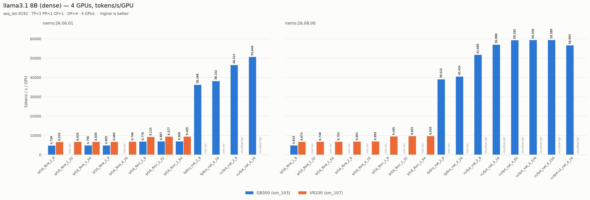
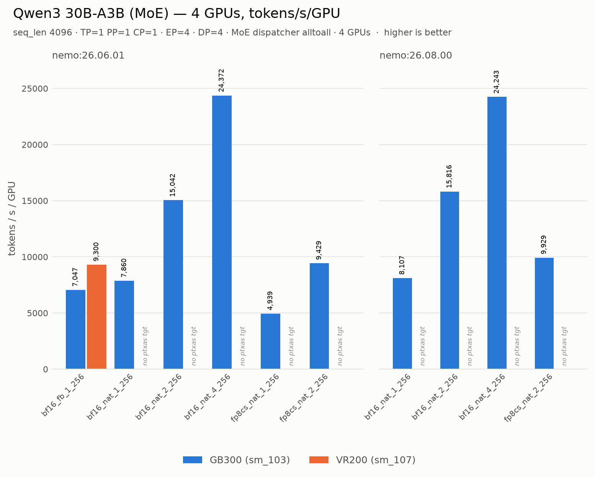

# Summary: GB300 (sm_103) vs Vera Rubin (sm_107), 4 GPUs

One-page version of this directory. Numbers are measured, not projected;
`COMPARISON.md` is the generated source for the tables below and `ISSUES.md`
has the defects with owners.

Both machines: 4 GPUs, one node, Megatron-Bridge `b50da4c`, 50 steps, metrics
averaged over iterations 35–44 by the recipe's own parser.

---

## The two headline numbers, and what each actually compares

**1. Same configuration, both machines: VR200 is 32–39% faster.**

The bf16 fallback is the only path sm_107 can execute, and it runs in
cuBLAS/cuDNN, which ship with the *driver* rather than the container — which is
why it works on an architecture the container has no cubins for. VR200 leads in
every cell of it: +35.9% to +38.6% on llama across five batch shapes, +32.0% on
Qwen3. That consistency matters — the lead is a property of the silicon, not of
one lucky config.

**2. Best achievable per machine: GB300 is 6.16× ahead on the dense model.**

Not because it computes faster — see (1) — but because it can reach nvfp4 at
all. VR200's tuned ceiling is 9,635 tok/s/GPU; GB300's is 59,389. That ratio is
the price of the missing kernels, and nothing about it is a hardware property.

> This supersedes the 6.31× recorded earlier. That figure used VR200's
> 26.06.01 ceiling of 9,405; the container lever then lifted VR200 to 9,635 on
> 26.08.00. The gap narrows as the reachable side is tuned, which is the point
> — it is a software gap, so it moves.

> **The two statements are not in tension.** Rubin wins the path both can run
> and is locked out of the path that is ~6× better. Quote them together or
> neither.

---

## Charts

One figure per workload, panelled by container so the bar labels need no
container token. Bars are `tok/s/GPU`; a bar that is absent carries the
attributed failure cause in its place, so "no bar" never reads as "no data".

Config shorthand is `<precision>_<path>_<MBS>_<GBS>` — so `bf16_fbre_1_8` is
bf16 via the fallback with recompute on, MBS=1, GBS=8:

| code | path |
| --- | --- |
| `fbre` | bf16 fallback, full activation recompute |
| `fbnr` | bf16 fallback, recompute off |
| `fb` | bf16 fallback (Qwen3: recompute is not a variable — its preset sets `cuda_graph_impl=transformer_engine`, which asserts against full recompute) |
| `nat` | native, no architecture workarounds |

Two things to read carefully. The y-axis is shared and linear from zero, which
compresses the bf16 rows against the ~60k nvfp4 bars — that 6× gap is the
headline, so it is not broken or log-scaled, and every bar prints its value.
And only 8 of the 65 configs ran on both machines, so most bars are
single-series: the quantized paths are GB300-only because sm_107 has no `ptxas`
target. Compare machines only where two bars sit side by side.

`comparison.csv` is the same data for spreadsheets.

## Raw comparisons

`%diff` is VR200 vs GB300 on tokens/s/GPU; positive means VR200 faster. Italic
cells are failures with the attributed cause. `precision` states what
*executed* — a bf16 fallback run reports `nvfp4` in the raw CSV because
llama31_8b has no bf16 preset, so the nvfp4 preset is selected and the
precision overridden.

Quote **tok/s/GPU**, not TFLOPS: TFLOPS comes from the framework's own
model-FLOPs accounting, which changed by a factor 0.953 between the two
containers, so the same physical work reports ~3% lower under 26.08.00.

### llama3.1 8B (dense)

seq_len 8192 · TP=1 PP=1 CP=1 · DP=4 · 4 GPUs

| container | precision | MBS | GBS | GB300 s/iter | GB300 TFLOPS/GPU | GB300 tok/s/GPU | VR200 s/iter | VR200 TFLOPS/GPU | VR200 tok/s/GPU | %diff |
| --- | --- | ---: | ---: | ---: | ---: | ---: | ---: | ---: | ---: | ---: |
| 26.06.01 | bf16 (fallback, recompute) | 1 | 8 | 3.457 | 243.91 | 4,739 | 2.504 | 336.81 | 6,543 | +38.1% |
| 26.06.01 | bf16 (fallback, recompute) | 1 | 32 | — | — | — | 9.891 | 341.02 | 6,626 | — |
| 26.06.01 | bf16 (fallback, recompute) | 1 | 64 | 27.364 | 246.54 | 4,790 | 19.743 | 341.70 | 6,639 | +38.6% |
| 26.06.01 | bf16 (fallback, recompute) | 2 | 8 | 3.410 | 247.32 | 4,805 | 2.460 | 342.88 | 6,660 | +38.6% |
| 26.06.01 | bf16 (fallback, recompute) | 4 | 16 | — | — | — | 4.843 | 348.27 | 6,766 | — |
| 26.06.01 | bf16 (fallback, no recompute) | 1 | 8 | 2.417 | 348.94 | 6,779 | 1.779 | 473.99 | 9,210 | +35.9% |
| 26.06.01 | bf16 (fallback, no recompute) | 1 | 32 | 9.516 | 354.44 | 6,887 | 6.989 | 482.68 | 9,377 | +36.2% |
| 26.06.01 | bf16 (fallback, no recompute) | 1 | 64 | 18.980 | 355.43 | 6,906 | 13.936 | 484.08 | 9,405 | +36.2% |
| 26.06.01 | bf16 (fallback, no recompute) | 2 | 8 | *oom_dense* |  |  | *oom_dense* |  |  | — |
| 26.06.01 | bf16 (fallback, no recompute) | 4 | 16 | — | — | — | *oom_dense* |  |  | — |
| 26.06.01 | fp8_cs | 2 | 8 | 0.453 | 1860.35 | 36,168 | — | — | — | — |
| 26.06.01 | fp8_cs | 4 | 16 | 0.860 | 1962.03 | 38,102 | — | — | — | — |
| 26.06.01 | fp8_cs | 8 | 32 | *oom_dense* |  |  | — | — | — | — |
| 26.06.01 | fp8_cs | 8 | 128 | *oom_dense* |  |  | — | — | — | — |
| 26.06.01 | nvfp4 | 1 | 8 | *fp8_dpa_no_backend* |  |  | — | — | — | — |
| 26.06.01 | nvfp4 | 2 | 8 | 0.353 | 2392.00 | 46,414 | *ptxas_no_target* |  |  | — |
| 26.06.01 | nvfp4 | 4 | 16 | 0.647 | 2607.07 | 50,646 | *ptxas_no_target* |  |  | — |
| 26.06.01 | nvfp4 | 4 | 64 | — | — | — | *ptxas_no_target* |  |  | — |
| 26.06.01 | nvfp4 | 4 | 128 | — | — | — | *ptxas_no_target* |  |  | — |
| 26.06.01 | nvfp4 | 4 | 256 | — | — | — | *ptxas_no_target* |  |  | — |
| 26.06.01 | nvfp4 | 8 | 32 | *oom_dense* |  |  | — | — | — | — |
| 26.06.01 | fp8_cs v2 | 2 | 8 | — | — | — | *ptxas_no_target* |  |  | — |
| 26.06.01 | fp8_cs v2 | 4 | 16 | — | — | — | *ptxas_no_target* |  |  | — |
| 26.06.01 | fp8_cs v2 | 4 | 256 | — | — | — | *ptxas_no_target* |  |  | — |
| 26.06.01 | nvfp4 v2 | 4 | 16 | — | — | — | *ptxas_no_target* |  |  | — |
| 26.08.00 | bf16 (fallback, recompute) | 1 | 8 | 3.400 | 236.61 | 4,819 | 2.455 | 327.76 | 6,674 | +38.5% |
| 26.08.00 | bf16 (fallback, recompute) | 1 | 32 | — | — | — | 9.712 | 331.37 | 6,748 | — |
| 26.08.00 | bf16 (fallback, recompute) | 1 | 64 | — | — | — | 19.406 | 331.68 | 6,754 | — |
| 26.08.00 | bf16 (fallback, recompute) | 2 | 8 | — | — | — | 2.409 | 333.92 | 6,801 | — |
| 26.08.00 | bf16 (fallback, recompute) | 4 | 16 | — | — | — | 4.754 | 338.45 | 6,893 | — |
| 26.08.00 | bf16 (fallback, no recompute) | 1 | 8 | — | — | — | 1.731 | 464.84 | 9,465 | — |
| 26.08.00 | bf16 (fallback, no recompute) | 1 | 32 | — | — | — | 6.826 | 471.45 | 9,601 | — |
| 26.08.00 | bf16 (fallback, no recompute) | 1 | 64 | — | — | — | 13.604 | 473.13 | 9,635 | — |
| 26.08.00 | bf16 (fallback, no recompute) | 2 | 8 | — | — | — | *oom_dense* |  |  | — |
| 26.08.00 | bf16 (fallback, no recompute) | 4 | 16 | — | — | — | *oom_dense* |  |  | — |
| 26.08.00 | fp8_cs | 2 | 8 | 0.420 | 1916.32 | 39,010 | — | — | — | — |
| 26.08.00 | fp8_cs | 4 | 16 | 0.810 | 1987.11 | 40,454 | — | — | — | — |
| 26.08.00 | nvfp4 | 2 | 8 | 0.317 | 2536.95 | 51,685 | *ptxas_no_target* |  |  | — |
| 26.08.00 | nvfp4 | 4 | 16 | 0.575 | 2797.83 | 56,988 | *ptxas_no_target* |  |  | — |
| 26.08.00 | nvfp4 | 4 | 64 | 2.211 | 2910.78 | 59,282 | *ptxas_no_target* |  |  | — |
| 26.08.00 | nvfp4 | 4 | 128 | 4.417 | 2914.67 | 59,349 | *ptxas_no_target* |  |  | — |
| 26.08.00 | nvfp4 | 4 | 256 | 8.828 | 2916.25 | 59,389 | *ptxas_no_target* |  |  | — |
| 26.08.00 | fp8_cs v2 | 2 | 8 | — | — | — | *ptxas_no_target* |  |  | — |
| 26.08.00 | fp8_cs v2 | 4 | 16 | — | — | — | *ptxas_no_target* |  |  | — |
| 26.08.00 | fp8_cs v2 | 4 | 256 | — | — | — | *ptxas_no_target* |  |  | — |
| 26.08.00 | nvfp4 v2 | 4 | 16 | 0.579 | 2778.50 | 56,594 | *ptxas_no_target* |  |  | — |

### Qwen3 30B-A3B (MoE)

seq_len 4096 · TP=1 PP=1 CP=1 · **EP=4** · DP=4 · MoE dispatcher **alltoall** · 4 GPUs

| container | precision | MBS | GBS | GB300 s/iter | GB300 TFLOPS/GPU | GB300 tok/s/GPU | VR200 s/iter | VR200 TFLOPS/GPU | VR200 tok/s/GPU | %diff |
| --- | --- | ---: | ---: | ---: | ---: | ---: | ---: | ---: | ---: | ---: |
| 26.06.01 | bf16 (fallback) | 1 | 256 | 37.202 | 162.12 | 7,047 | 28.189 | 213.98 | 9,300 | +32.0% |
| 26.06.01 | bf16 (fallback) | 2 | 256 | — | — | — | *oom_moe* |  |  | — |
| 26.06.01 | bf16 (fallback) | 4 | 256 | — | — | — | *oom_moe* |  |  | — |
| 26.06.01 | bf16 | 1 | 256 | 33.350 | 180.84 | 7,860 | *ptxas_no_target* |  |  | — |
| 26.06.01 | bf16 | 2 | 256 | 17.427 | 346.08 | 15,042 | *ptxas_no_target* |  |  | — |
| 26.06.01 | bf16 | 4 | 256 | 10.756 | 560.69 | 24,372 | *ptxas_no_target* |  |  | — |
| 26.06.01 | bf16 | 8 | 256 | *oom_moe* |  |  | — | — | — | — |
| 26.06.01 | fp8_cs | 1 | 256 | 53.072 | 113.64 | 4,939 | *ptxas_no_target* |  |  | — |
| 26.06.01 | fp8_cs | 2 | 256 | 27.801 | 216.93 | 9,429 | *ptxas_no_target* |  |  | — |
| 26.06.01 | fp8_cs | 4 | 256 | — | — | — | *ptxas_no_target* |  |  | — |
| 26.06.01 | fp8_cs | 8 | 256 | *oom_moe* |  |  | — | — | — | — |
| 26.08.00 | bf16 (fallback) | 2 | 256 | — | — | — | *oom_moe* |  |  | — |
| 26.08.00 | bf16 (fallback) | 4 | 256 | — | — | — | *oom_moe* |  |  | — |
| 26.08.00 | bf16 | 1 | 256 | 32.335 | 186.50 | 8,107 | *ptxas_no_target* |  |  | — |
| 26.08.00 | bf16 | 2 | 256 | 16.575 | 363.82 | 15,816 | *ptxas_no_target* |  |  | — |
| 26.08.00 | bf16 | 4 | 256 | 10.813 | 557.66 | 24,243 | *ptxas_no_target* |  |  | — |
| 26.08.00 | fp8_cs | 1 | 256 | *unknown* |  |  | *ptxas_no_target* |  |  | — |
| 26.08.00 | fp8_cs | 2 | 256 | 26.402 | 228.40 | 9,929 | *ptxas_no_target* |  |  | — |
| 26.08.00 | fp8_cs | 4 | 256 | *unknown* |  |  | *ptxas_no_target* |  |  | — |

---

## What each knob does, and what it was worth

| Lever | What it is | llama3.1 8B | Qwen3 30B-A3B |
| --- | --- | --- | --- |
| **recompute** | Recomputes activations in the backward pass instead of storing them. Trades ~30% extra compute for activation memory. | **Off is worth +41% on VR200, +43–44% on GB300.** The single largest portable lever on both. | **Not available** — its preset uses `cuda_graph_impl=transformer_engine`, and full recompute asserts it needs a full-iteration graph. |
| **MBS** (micro-batch) | Samples per forward pass. Drives GEMM efficiency; memory-bound. | +1.8% (MBS=2), +3.4% (MBS=4) — **and only *with* recompute.** Without it, MBS≥2 OOMs on *both* machines. | **The biggest lever on GB300 (3.10×) and unreachable on VR200.** See below. |
| **GBS** (global batch) | Samples per optimizer step. `GBS = MBS × DP × GA`, so raising it at fixed MBS raises gradient accumulation, amortising the optimizer step and DP all-reduce over more microbatches. | +1.3–2.1% (8→64). Stacks cleanly with recompute; neither lever enables the other. | **No headroom** — already GBS=256 / GA=64. For this model the batch lever is MBS, not GBS. |
| **container** | `nemo:26.06.01` → `26.08.00`. | +1.7–2.8% on the fallback path. Free if it works. | No change; still OOMs at MBS≥2. |
| **precision** | bf16 → fp8_cs / nvfp4. | GB300 only: nvfp4 reaches 59,389 tok/s/GPU, ~9× the bf16 fallback. | GB300 only, **and it is a regression**: fp8_cs at MBS=1 is 4,939 vs bf16's 7,860 — **37% slower**. |

### The Qwen3 MBS result is the one to understand

It inverts the dense intuition twice, and it is the single most instructive
finding in the matrix.

On GB300, raising Qwen3's MBS from 1 to 4 gives **3.10×** (7,860 → 24,372
tok/s/GPU) — larger than every other lever combined. It looks like pure batch
shape with no kernel involved, so it should transfer to any machine. It does
not, and both routes are closed:

- The **native** path (where the 3.10× was measured) carries no arch
  workarounds, so it uses cuDNN **fused** attention. On sm_107 it never starts:
  every native row dies at `ptxas_no_target` with zero iterations.
- The **fallback** path forces `NVTE_UNFUSED_ATTN=1`, and unfused attention
  materialises the score matrix, which scales with MBS. MBS=2 and MBS=4 both
  OOM.

So MBS is *not* arch-independent in the fallback path — it is entangled with
the one kernel sm_107 lacks. **A `nat-` measurement cannot predict a `por-`
result**, which is exactly why the matrix separates the two row sets.

### And the dense MBS=1 rule needed restating, not deleting

The original guidance bundled "MBS=1 **plus** full recompute" as one unit. They
are separable, and the bundling cost 41%:

- MBS=1 alone is sufficient — recompute was never needed at that shape.
- MBS>1 genuinely does require recompute: MBS=2 without it OOMs on **both**
  machines (GB300 tried 8.00 GiB with 662 MiB free; VR200 tried 4.64 GiB with
  4.61 GiB free). The 8.00 GiB is exactly what the score matrix costs at
  `mbs × heads × seq × seq × 2 B`, seq 8192, MBS=2 — so the documented
  mechanism is confirmed, not merely plausible.

Accurate form: **"MBS>1 requires recompute, and recompute costs more than the
higher MBS returns."**

---

## Why the two models are in separate tables

They are not comparable to each other. llama3.1 8B is dense at seq_len 8192;
Qwen3 30B-A3B is MoE at seq_len 4096 with `EP=4` and the `alltoall` dispatcher.
`tok/s/GPU` is only meaningful within a workload, and the levers behave
oppositely across them — MBS is decisive for the MoE model and near-irrelevant
for the dense one, while recompute is the reverse.

Two Qwen3-specific settings are deviations from the shipped preset, and both
should be reported with any number: `EP=4` because the preset assumes `EP=8`
across 8 GPUs, and `MOE_BACKEND=alltoall` because the preset selects HybridEP,
which assumes an NVL72 domain. Note `apply_flex_dispatcher_backend()`'s guard
is `major in [8, 9, 10]`, so on a major-10 part HybridEP *engages* rather than
being skipped — it has to be disabled deliberately.

---

## What is blocked on a new container

Three items, out of twelve total defects — the rest are upstream presets, our
tooling, or analysis errors. Full detail with owners in `ISSUES.md`.

1. **TE ships no `sm_107` cubin and no PTX** (`te_ptx_entries=0`), so every
   quantized precision hard-fails with no JIT fallback.
2. **Bundled `ptxas` has no `sm_107` target**, breaking Triton and everything
   built on it. Needs `ptxas` *and* Triton's bundled LLVM, which writes
   `.target sm_107a` while itself warning the processor is unrecognised.
3. **cuDNN builds no fused-attention plan**, which forces unfused attention and
   is therefore the root cause of the MBS ceiling above.

**Ordering note.** On sm_107 the *first* wall in the native path is (2), not
(1): every native row dies at `ptxas_no_target` before reaching a TE kernel.
So fixing TE alone would not make the shipped presets run — it would unblock
quantization only in a Triton-disabled configuration. (1) is still the cheapest
and best-evidenced ask, because `sm_103f`, plain `sm_103` and driver-JIT'd
`compute_103` PTX all produce correct results on sm_107 while the shipped
`sm_103a` reproduces TE's error verbatim, and CUDA 13.3 already emits
`sm_103f` — it is a build flag, not a new toolchain.

**Nothing above blocks running today.** VR200 went from 6,543 to 9,635
tok/s/GPU — 1.47× — with no container change at all.
